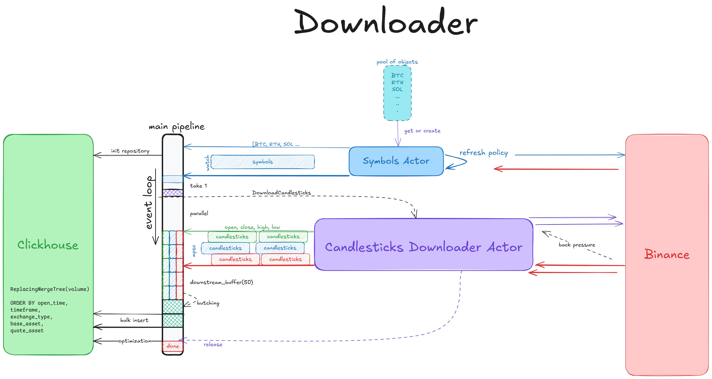
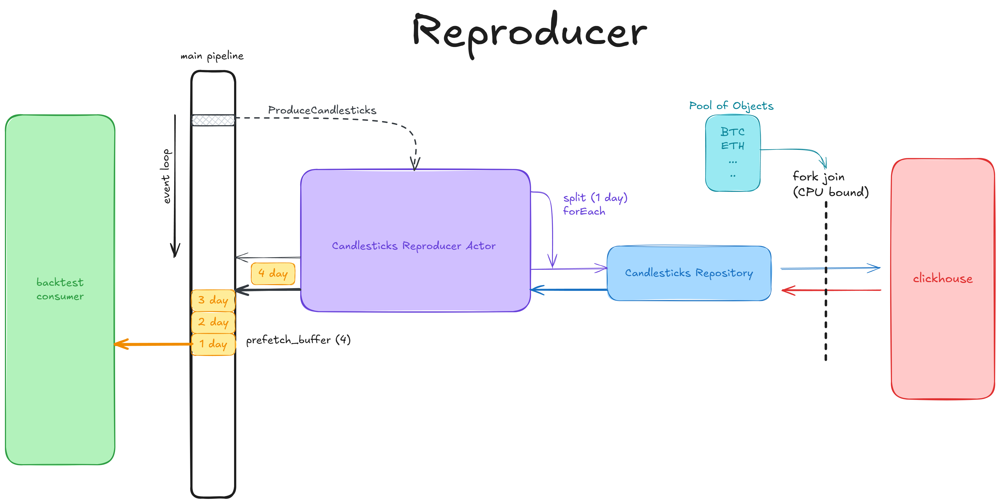

### 👨🏻‍💻 Motivation:

Candlesticks Assistant. This application was developed as part of a research project
to evaluate the `expressiveness` and `performance` of the `Rust` programming language.
The selected domain is data preparation for `backtesting` trading strategies,
which is a component of my product previously implemented in Java.

### 🧩 Application structure
The workspace of this application consists of two crates: `core` and `backtest`.

The backtest crate, in particular, is divided into two applications:
- `History Downloader` - fetch historical data into local storage
- `History Reproducer` - replay historical data from local storage

### 🚀 Optimizations and Expressiveness

Both applications are optimized to achieve __blazing fast__ performance.
- The high-level API is implemented in a declarative style
- An actor model is used to manage services lifecycles and hide imperative complexity.
- Channels are used to transmit data flows between components in a safe way
- The application combines an event loop and a thread pool for I/O and CPU tasks.
- An object pool is used to avoid unnecessary allocations.


## 📥 History Downloader

*History Downloader* application connects to the exchange (Binance) and performs requests 
using **multiple threads**. It respects exchange rate limits and **ensures backpressure**
is properly handled. The retrieved data is accumulated in a buffer (50 items by default),
then sliced into batches and inserted into the database in groups (bulk insert).





## 🔥 History Reproducer

This application loads data from the database in slices and pushes it into the stream buffer. 
By default, it performs prefetching for 4 slices. As a CPU-level optimization,
the conversion of database objects into application objects is performed in 
a synchronous fork-join pool running outside the `single threaded` `event loop`. 
Additionally, data compression in the database client is disabled, since the database is assumed 
to be deployed in a local network and the main bottleneck is the CPU calculations
of the back-test application.

Once you fetch stream, it is recommended to accumulate it into `ring buffer`
data structures for further processing.




## ⛹🏻‍♂️ How to run?

Code is ready to run. All you need is to set up `Clickhouse`. Default configuration is provided.
Check `candy-ass-backtest\docker-compose.yml` first and then define your properties 
in `.env` configuration. It is recommended to use keep `Clickhouse` instance on local network.

The application offers minimal configuration options for ease of use, 
but users are free to choose how flexible they want their setup to be.

Entry points you can find in `candy-ass-backtest\bin` folder. Example `.env`: 

```
CANDY__CLICKHOUSE__HOST=http://127.0.0.1
CANDY__CLICKHOUSE__PORT=8123
CANDY__CLICKHOUSE__USERNAME=candy-ass
CANDY__CLICKHOUSE__PASSWORD=123
```

Regarding `multiple` runs:
1. the application automatically checks for the existence of all 
required tables and initializes them if necessary.
2. It is safe to run the application multiple times in a row.  
And you should not care about the duplicates.
3. After the import is complete, the program will 
prompt the user to `run` an `optimization` procedure, which removes duplicates and optimizes 
the data source for reading.
